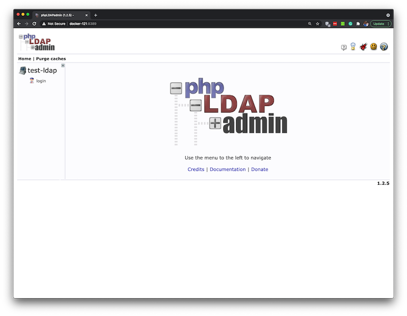

# Dockerized OpenLDAP
Dockerized OpenLDAP using Osixia's OpenLDAP with phpLDAPAdmin

## Configuring OpenLDAP and phpLDAPAdmin
The purpose of this docker composer is to create a docker container for OpenLDAP. Settings have been preconfigured to allow this to run quickly. Here are the basic configuration items in the docker-compose-yml:

```
      LDAP_BASE_DN: "dc=test,dc=com"
      LDAP_ADMIN_PASSWORD: "admin"

      LDAP_TLS: "false"
```

***NOTE***: TLS/SSL is disabled in the supplied docker-compose.yml. If TLS is enabled, certificates will need to be generated and the LDAP_TLS_* environment variables will need to point to appropriate configuration files or settings.

OpenLDAP is configurd to listen on port 389, but exposes the LDAP outside the container on port 3389. Similarly, the phpLdapAdmin listens on port 80 within the container, but is exposed as port 8389. To change these ports, please look in the docker-compose.yml file:

```
services:
  openldap:
    image: osixia/openldap:1.2.3
.
.
.
    ports:
      - "3389:389"
      - "3636:636"
```
 
Take note that the port 636 is the default TlS port and it is exposed on 3636 outside the container to the host. By default, the docker-compose.yml disables TLS.

For the phpLdapAdmin, the docker-compose.yml file can also be edited to change the ports used;

```
  phpldapadmin:
    image: osixia/phpldapadmin:latest
    container_name: phpldapadmin
.
.
.
    ports:
      - "8389:80"
```

## Creating OpenLDAP and phpLDAPAdmin
Create the OpenLDAP Server and the phpLdapAdmin by executing Docker compose:

	docker-compose up -d

## Using phpLdapAdmin

Using the docker-compose.yml provided here, you should be able to access the phpLDAPadmin web page using the following URL:

	http://<hostname>:8389




## Anonymous vs. Authenticated Access

Access to phpLDAPadmin can be anonmous or authenticated. For anonymous access, simply click the login link and check the anonymous checkbox before clicking teh "Authenticate" button. For authenticated access, use the 'admin' user distinguished name (DN). The DN for the admin provided in this example is;

	cn=admin, dc=test, dc=com

The password is specified in the docker-compose.yml. The default value, provided in this example docker-compose.yml file, is:

	admin

For additional information on running phpLdapAdmin can be found at [docker-phpLDAPadmin Github page](https://github.com/osixia/docker-phpLDAPadmin).


# Diagnostics and Uninstalling Containers

## Stopping the LDAP Server
To stop the OpenLDAP server's container simply issue the following command;

	docker container stop test-ldap

## Stopping phpLdapAdmin
To stop the phpLdapAdmin container simply issue the following command;

	docker container stop phpldapadmin

## Removing the Containers
To remove the containers, simply execute the docker container rm command:

	docker container rm test-ldap phpldapadmin

## Container Logs
To view the container logs, use the following commands:

	docker logs test-ldap
	docker logs phpldapadmin


